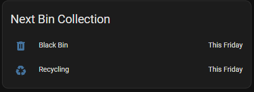

# BinDayChecker
A Bin Day Checker script to poll the BANES website for collection days and post the data to Home Assistant

This is a temporary solution to fix the `[SSL: UNSAFE_LEGACY_RENEGOTIATION_DISABLED]` error when using the RESTful sensor within Home Assistant to poll the BANES website directly.

## How it works
The Python script in `src` will poll the BANES API for the latest bin day dates and push this data into Home Assistant using the HTTP sensor which wil create a sensor for each collection type.

`sensor.black_bin_day` and `sensor.green_bin_day` will be created.

As per the HA docs, HTTP sensors only exist for as long as Home Assistant is running. This script will therefore run in a loop to repeatedly send POST requests to HA every 30 seconds, but only poll the BANES website for updates every 1 hour.

https://www.home-assistant.io/integrations/http/#sensor
>The HTTP sensor is dynamically created with the first request that is made to its URL. You don’t have to define it in the configuration first.
>
>The sensor will then exist as long as Home Assistant is running. After a restart of Home Assistant the sensor will be gone until it is triggered again.

## Run the script
The Python script can be run as a systemd service, or as a conatiner. 

The following environment variables must be set:

- `BIN_DAY_URL` = The URL of the BANES API with the route ID: E.g. "https://www.bathnes.gov.uk/NodeAPI/waste/bins/getRoute/CHANGE-ME"
- `HA_URL` = THE URL of the home assistant http endpoint (without the sensor name): E.g. "https://CHANGE-ME/api/states"
- `HA_TOKEN` = The long lived Home Assistant token. https://developers.home-assistant.io/docs/auth_api/#long-lived-access-token
### Run as a container
#### Docker
To run this script as a container, a dockerfile is in the "build" folder.

The build the image, run:
>`docker build -t bin-day-checker:latest -f build/Dockerfile .`

Then tag and push to a desired container registry.

#### Kubernetes Deployment
Within the deploy within Kubernetes, the "deploy" folder contains a deployment and secret manifest. The deployment takes secrrets from the secret manifest to populate the environment variables. Update the secret manifest with desired values.